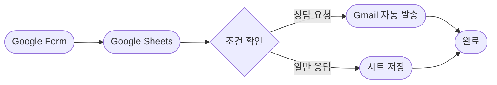

# Project 03
# Google Form 기반 프로그램 만족도 조사 및 상담 신청 자동화

## 1. 프로젝트 개요

본 프로젝트는 Google Form으로 프로그램 만족도 조사와 상담 신청을 수집하고, Google Sheets와 Make를 연동하여 반복 업무를 자동화하는 것을 목표로 한다. 상담 신청이나 낮은 만족도 응답이 접수되면 담당자에게 Gmail로 자동 알림을 전송하도록 구현한다.

---

## 2. 자동화가 필요한 이유

| 기존 업무         | 자동화 후     |
| ------------- | --------- |
| 설문을 수동 확인     | 응답 즉시 저장  |
| 상담 신청자를 직접 확인 | 자동 이메일 발송 |
| 응답 누락 가능      | 조건별 자동 분류 |
| 처리 지연         | 즉시 대응 가능  |

## 3. 사용 도구

| 구분 | 사용 도구 | 역할 |
|---|---|---|
| 설문 수집 | Google Forms | 만족도 및 상담 요청 수집 |
| 데이터 저장 | Google Sheets | 응답 내용 기록 |
| 자동화 도구 1 | Make | 자동화 구현 |
| 자동화 도구 2 | Zapier | 동일한 자동화 구현 |
| 알림 | Gmail | 담당자 알림 전송 |

## 4. 설문 구성

| 문항 | 형식 | 활용 목적 |
|---|---|---|
| 참여자 이름 | 단답형 | 응답자 구분 |
| 참여 프로그램 | 드롭다운 | 프로그램 분류 |
| 참여 날짜 | 날짜 | 참여 일자 기록 |
| 전체 만족도 | 1~5점 | 불만족 응답 판단 |
| 상담 필요 여부 | 예/아니요 | 상담 요청 판단 |
| 상담 내용 | 장문형 | 담당자 확인 |

## Google Form 설계

프로그램 만족도 조사와 상담 신청을 하나의 폼으로 구성하였다.

### 입력 항목

- 참여자 성함
- 이메일 주소
- 참여 프로그램
- 참여 날짜
- 프로그램 만족도(1~5점)
- 개선사항
- 상담 필요 여부
- 상담 내용

### 설계 목적

- 만족도 데이터 자동 수집
- 상담 신청자 자동 분류
- Google Sheets 연동
- Gmail 자동 알림
- 향후 통계 분석 활용

[Google Form](https://forms.gle/aSaaMqjpnfSsThc76)

## 5. 자동화 조건

- 만족도가 1~2점이면 긴급 확인 대상으로 분류한다.
- 상담 요청이 '예'이면 상담 요청 대상으로 분류한다.
- 위 조건에 해당하면 담당자에게 이메일을 보낸다.
- 일반 응답은 Google Sheets에만 기록한다.

## 6. 워크플로우

## 7. Make 구현 결과

### 구현 기능

- Google Form 응답 자동 수집
- Google Sheets 자동 저장
- Make를 이용한 자동화
- Router를 통한 조건 분기
- 상담 요청 자동 이메일 발송
- 만족도 2점 이하 자동 이메일 발송

### 테스트 결과

| 테스트 항목 | 결과 |
|-------------|------|
| Google Form 응답 | ✅ 성공 |
| Google Sheets 저장 | ✅ 성공 |
| 상담 요청 메일 | ✅ 성공 |
| 만족도 낮음 메일 | ✅ 성공 |

### 기대 효과

- 상담 요청을 즉시 확인할 수 있다.
- 만족도가 낮은 참여자를 빠르게 관리할 수 있다.
- 수작업 확인 과정을 줄여 업무 효율을 높일 수 있다.

## 8. Zapier 구현 결과

Zapier에서 제작한 자동화 과정과 실행 결과를 작성 예정

## 9. 도구 비교

Make와 Zapier의 사용성, 설정 난이도, 무료 범위,
실행 결과 확인 방법을 비교한다. 

## 10. 테스트 결과

| 테스트    | 결과 |
| ------ | -- |
| 정상 응답  | 예정 |
| 상담 신청  | 예정 |
| 낮은 만족도 | 예정 |

## 11. 결론

자동화를 통해 설문 확인 시간을 줄이고,
상담 또는 불만족 응답을 신속하게 확인할 수 있었다.

## 12. 개인정보 보호

과제 테스트에는 실제 학생 정보가 아닌 가상 데이터를 사용하였다.
API Key, 비밀번호, 개인 이메일 주소는 공개하지 않았다.
