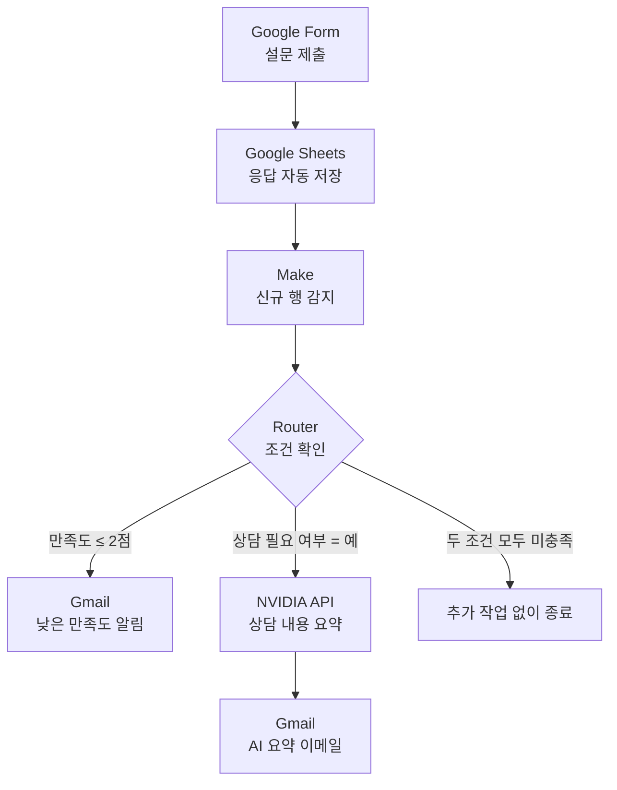
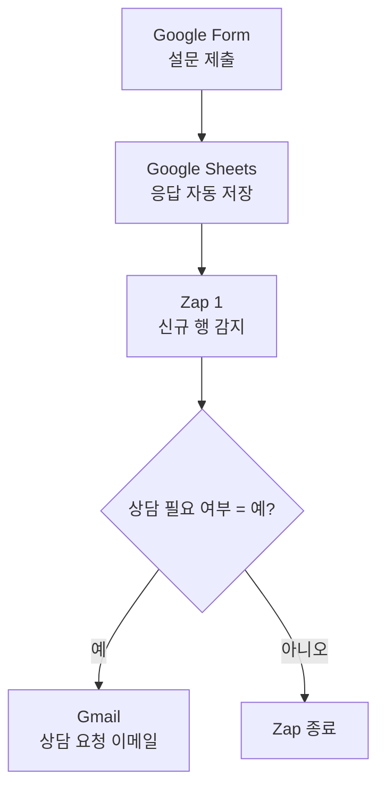
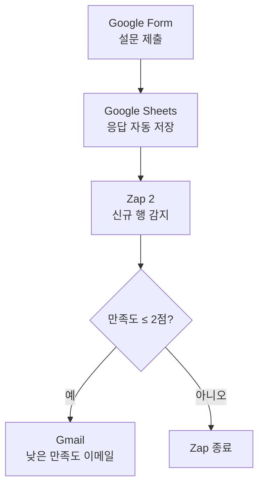
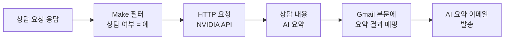

# Project 03. Google Form 기반 프로그램 만족도 조사 및 상담 신청 노코드 자동화

> Google Form 응답을 Google Sheets에 자동 저장하고, Make와 Zapier를 이용해 상담 요청과 낮은 만족도 응답을 조건별로 분류하여 Gmail 알림을 발송한 프로젝트입니다. 보너스 기능으로 Make에 NVIDIA 생성형 AI API를 연동해 상담 요청 내용을 요약한 이메일을 자동 발송하도록 구현했습니다.


## 관련 문서

- [작업 기록 보기](./WORKLOG.md)
- [자동화 흐름도 보기](./flowchart.md)
- [Google Form 열기](https://forms.gle/aSaaMqjpnfSsThc76)

---

## 1. 프로젝트 개요

### 1.1 프로젝트 주제

Google Form을 이용해 프로그램 만족도와 상담 요청을 수집하고, Google Sheets·Make·Zapier·Gmail을 연동해 조건에 맞는 이메일을 자동 발송하는 노코드 자동화 프로젝트이다.

### 1.2 프로젝트 목적

프로그램 담당자가 설문 응답을 반복적으로 확인하는 업무를 줄이고, 상담 요청이나 낮은 만족도 응답을 빠르게 확인할 수 있도록 자동화하는 것을 목적으로 한다.

보너스 과제에서는 NVIDIA 생성형 AI API를 연동해 상담이 필요한 응답의 개선사항과 상담 내용을 요약한 이메일을 발송하도록 확장하였다.

---

## 2. 자동화가 필요한 이유

| 기존 업무 | 자동화 후 |
|---|---|
| 설문 응답을 사람이 반복 확인 | Google Sheets에 자동 저장 |
| 상담 요청자를 직접 검색 | 조건에 맞으면 자동 이메일 발송 |
| 낮은 만족도 응답을 수동 분류 | 만족도 조건으로 자동 분류 |
| 장문의 상담 내용을 직접 검토 | NVIDIA AI가 핵심 내용 요약 |
| 담당자의 확인이 늦어질 가능성 | 최대 15분 간격으로 신규 응답 확인 |
| 응답 누락 및 분류 오류 가능성 | 조건과 필터에 따라 일관되게 처리 |

---

## 3. 사용 도구

| 구분 | 사용 도구 | 역할 |
|---|---|---|
| 설문 수집 | Google Forms | 만족도와 상담 요청 수집 |
| 데이터 저장 | Google Sheets | 설문 응답 자동 저장 |
| 자동화 도구 1 | Make | Router 분기와 NVIDIA API 연동 |
| 자동화 도구 2 | Zapier | 조건별 Zap 2개 구현 |
| 이메일 알림 | Gmail | 담당자에게 조건별 알림 발송 |
| 생성형 AI | NVIDIA AI API | 개선사항과 상담 내용 요약 |
| API 연결 | Make HTTP 모듈 | NVIDIA API 요청 및 응답 처리 |
| 문서 관리 | GitHub | 구현 과정과 결과 기록 |

---

## 4. Google Form 설계

프로그램 만족도 조사와 상담 신청을 하나의 Google Form으로 구성하였다.

| 문항 | 형식 | 활용 목적 |
|---|---|---|
| 참여자 성함 | 단답형 | 응답자 구분 |
| 이메일 주소 | 단답형 | 필요할 경우 상담 연락 |
| 참여 프로그램 | 드롭다운 | 프로그램별 응답 분류 |
| 참여 날짜 | 날짜 | 프로그램 참여일 기록 |
| 프로그램 만족도 | 1~5점 | 낮은 만족도 응답 판별 |
| 개선사항 | 장문형 | 프로그램 개선 의견 수집 |
| 상담 필요 여부 | 예/아니요 | 상담 요청 응답 판별 |
| 상담 내용 | 장문형 | 상담 요청 내용 확인 및 AI 요약 |

### 설계 목적

- 만족도 데이터 자동 수집
- 상담 신청자 자동 분류
- 낮은 만족도 응답 자동 확인
- Gmail 조건별 알림
- NVIDIA AI를 이용한 장문 응답 요약
- 향후 만족도 통계와 프로그램 개선 자료로 활용

[Google Form 바로가기](https://forms.gle/aSaaMqjpnfSsThc76)

---

## 5. 최종 자동화 조건

### 5.1 Make 최종 분기 조건

Make에서는 하나의 시나리오 안에 Router를 구성하고 두 개의 일반 분기를 설정하였다.

| 분기 | 최종 필터 조건 | Fallback route | 처리 결과 |
|---|---|:---:|---|
| 낮은 만족도 알림 | 프로그램 만족도 `Less than or equal to 2` | No | 낮은 만족도 이메일 발송 |
| NVIDIA AI 요약 | 상담 필요 여부 `Equal to 예` | No | NVIDIA API 호출 후 AI 요약 이메일 발송 |
| 조건 미충족 | 만족도 3점 이상이고 상담 요청이 아니오 | 해당 없음 | Google Sheets 저장 후 종료 |

두 조건을 모두 충족하면 두 분기가 각각 실행된다.

- 만족도 2점 이하 → 낮은 만족도 이메일
- 상담 필요 여부 `예` → NVIDIA AI 요약 이메일
- 만족도 2점 이하이면서 상담 필요 여부 `예` → 이메일 2통 발송

### 5.2 Zapier 최종 분기 조건

Zapier에서는 상담 요청과 낮은 만족도 조건을 각각 별도의 Zap으로 구성하였다.

| Zap | Filter 조건 | 처리 결과 |
|---|---|---|
| 상담 요청 Zap | 상담 필요 여부가 `예` | 상담 요청 이메일 발송 |
| 낮은 만족도 Zap | 프로그램 만족도가 `2점 이하` | 낮은 만족도 이메일 발송 |

두 조건을 모두 충족하면 두 개의 Zap이 각각 실행되어 이메일 두 통이 발송된다.

---

## 6. 전체 워크플로우

### 6.1 Make 최종 자동화 흐름도


### Make 분기 조건

| 분기 | 필터 조건 | 처리 결과 |
|---|---|---|
| 낮은 만족도 분기 | 프로그램 만족도 `2점 이하` | 낮은 만족도 이메일 발송 |
| NVIDIA AI 요약 분기 | 상담 필요 여부 `예` | NVIDIA API 호출 후 AI 요약 이메일 발송 |
| 조건 미충족 | 만족도 3점 이상이고 상담 요청이 `아니오` | 추가 작업 없이 종료 |

두 분기는 모두 일반 분기로 설정했으며 `Fallback route`는 사용하지 않았다.

두 조건을 동시에 충족하면 Make에서 다음 이메일 두 통이 각각 발송된다.

1. 낮은 만족도 알림 이메일
2. NVIDIA AI 상담 요약 이메일

---

Make 무료 플랜에서는 `Google Sheets - Watch New Rows` 모듈이 최소 15분 간격으로 신규 응답을 확인한다. 이는 이메일을 15분마다 보내는 것이 아니라, 새로운 설문 응답이 있는지 15분마다 확인하는 방식이다.

### 6.2 Zapier 상담 요청 Zap



---

### 6.3 Zapier 낮은 만족도 Zap



Zapier에서는 상담 요청과 낮은 만족도 알림을 하나의 Zap에서 분기하지 않고, 조건별로 두 개의 Zap을 구성하였다.

---

### 6.4 Make와 Zapier 구성 차이

| 구분 | Make | Zapier |
|---|---|---|
| 자동화 구성 | 하나의 시나리오에서 Router로 분기 | 조건별 Zap 2개로 분리 |
| 낮은 만족도 처리 | 낮은 만족도 이메일 발송 | 낮은 만족도 이메일 발송 |
| 상담 요청 처리 | NVIDIA AI 요약 이메일 발송 | 일반 상담 요청 이메일 발송 |
| AI 기능 | NVIDIA AI API 연동 | 적용하지 않음 |
| 두 조건 동시 충족 | 두 분기가 각각 실행 | 두 Zap이 각각 실행 |
| 최종 발송 결과 | 낮은 만족도 메일 + AI 요약 메일 | 낮은 만족도 메일 + 상담 요청 메일 |

---

### 6.5 조건별 최종 실행 결과

| 설문 응답 조건 | Make 실행 결과 | Zapier 실행 결과 |
|---|---|---|
| 만족도 2점 이하·상담 아니오 | 낮은 만족도 메일 | 낮은 만족도 메일 |
| 만족도 3점 이상·상담 예 | NVIDIA AI 요약 메일 | 상담 요청 메일 |
| 만족도 2점 이하·상담 예 | 낮은 만족도 메일 + AI 요약 메일 | 낮은 만족도 메일 + 상담 요청 메일 |
| 만족도 3점 이상·상담 아니오 | 추가 작업 없음 | 두 Zap 모두 종료 |

두 조건을 모두 충족하면 Make에서 2통, Zapier에서 2통으로 총 4통의 이메일이 발송된다.

---


## 7. Make 기본 자동화 구현 과정

기본 과제에서는 상담 요청 알림과 낮은 만족도 알림을 먼저 구현하였다. 이후 보너스 과제에서 상담 요청 분기를 NVIDIA AI 요약 경로로 확장하였다.

### Make 기본 자동화 구성

1. Google Sheets 신규 응답 감지
2. Router를 이용한 조건 분기
3. 상담 필요 여부가 `예`인 응답 판별
4. 만족도가 `2점 이하`인 응답 판별
5. 조건에 따라 Gmail 알림 발송
6. 보너스 과제에서 NVIDIA API 연동
7. AI 요약 결과를 Gmail 본문에 매핑

#### 1. 상담 요청 조건이 포함된 Google Form


#### 2. Google Form 응답이 저장된 Google Sheets


#### 3. Google Sheets 신규 응답 감지 모듈 설정


#### 4. Google Sheets 신규 응답 감지 테스트 성공


#### 5. 조건별 처리를 위한 Router 추가


#### 6. 상담 요청 응답 필터 설정


#### 7. 상담 요청 이메일 내용 매핑


#### 8. 상담 요청 이메일 수신 결과


#### 9. 낮은 만족도 응답 필터 설정


#### 10. 낮은 만족도 이메일 수신 결과


#### 11. 두 조건 동시 충족 테스트 결과


#### 12. Make 기본 자동화 최종 시나리오


> 위 12개 이미지는 기본 자동화 구현 과정을 기록한 자료이다. 최종 보너스 시나리오에서는 상담 요청 분기를 NVIDIA AI 요약 경로로 확장하였다.

---

## 8. Zapier 구현 결과

### 8.1 구현 방식

Zapier에서는 Paths를 사용하지 않고 상담 요청과 낮은 만족도 조건을 각각 별도의 Zap으로 구성하였다.

각 Zap의 구조는 다음과 같다.

```text
Google Sheets → Filter by Zapier → Gmail
```

이번 과제의 Filter가 포함된 다단계 Zap은 14일 Professional 체험 기능을 활용해 구현하였다. 체험 종료 후 Free 플랜으로 전환하면 다단계 Zap의 계속 사용이 제한될 수 있다.

### 8.2 테스트 결과

| 테스트 조건 | 결과 |
|---|---|
| 상담 요청 `예`, 만족도 3점 이상 | 상담 요청 메일 발송 성공 |
| 상담 요청 `아니오`, 만족도 2점 이하 | 낮은 만족도 메일 발송 성공 |
| 두 Zap 활성화 | 조건별 정상 실행 확인 |

### 8.3 Zapier 전체 자동화 구성

#### 1. Google Sheets 트리거 계정 연결


#### 2. 설문 응답 스프레드시트 및 워크시트 선택


#### 3. Google Sheets 트리거 테스트


#### 4. 자동화 테스트용 설문 응답 선택


#### 5. Gmail 알림 이메일 본문 매핑


#### 6. 조건별 Zap 2개 활성화


#### 7. 상담 요청 응답 필터 설정


#### 8. 낮은 만족도 응답 필터 설정


#### 9. 상담 요청 알림 Zap 전체 구성


#### 10. 낮은 만족도 알림 Zap 전체 구성


#### 11. 상담 요청 알림 이메일 수신 결과


#### 12. 낮은 만족도 알림 이메일 수신 결과


---

## 9. NVIDIA AI 보너스 기능

### 9.1 기능 설명

기본 자동화에 NVIDIA 생성형 AI API를 연동하여 상담을 요청한 응답자의 개선사항과 상담 내용을 자동으로 요약하도록 구현하였다.

AI 요약 기능의 실행 조건은 다음과 같다.

```text
상담 필요 여부 = 예
```

만족도 점수와 관계없이 상담 필요 여부가 `예`인 응답만 NVIDIA API로 전달된다.

### 9.2 처리 과정



AI 요약 기능은 만족도 점수가 아니라 `상담 필요 여부 = 예` 조건을 기준으로 실행된다.

Make 무료 플랜에서는 Google Sheets의 신규 응답을 최소 15분 간격으로 확인한다. 이는 이메일을 15분마다 반복 발송하는 것이 아니라, 새로운 설문 응답이 있는지 15분마다 확인하는 방식이다.

1. Google Form 응답 제출
2. Google Sheets 신규 행 저장
3. Make에서 `상담 필요 여부 = 예` 조건 확인
4. 개선사항과 상담 내용을 NVIDIA API로 전달
5. NVIDIA AI가 핵심 내용을 요약
6. HTTP 응답에서 생성된 요약문 추출
7. 설문 정보와 AI 요약문을 Gmail 본문에 매핑
8. 담당자에게 AI 요약 이메일 발송

### 9.3 구현 결과

HTTP 요청 과정에서 JSON 문자열과 매핑값 오류가 발생했으나, 요청 본문 구조와 응답 필드 매핑을 수정하여 최종적으로 HTTP 상태 코드 `200`과 AI 요약 이메일 수신을 확인하였다.

#### 1. NVIDIA AI 모델 및 프롬프트 설정


#### 2. Google Form 설문 응답 데이터 매핑


#### 3. NVIDIA AI가 포함된 Make 시나리오 실행 성공


#### 4. NVIDIA AI 응답 요약 결과 생성


#### 5. NVIDIA API 응답과 Gmail 본문 연결


#### 6. AI 요약 이메일 수신 결과


#### 7. 상담 요청 AI 요약 필터 최종 설정


---

## 10. 최종 테스트 결과

### 10.1 테스트 기준

최종 테스트에는 실제 학생 정보가 아닌 가상 응답을 사용하였다.

| 테스트 | 프로그램 만족도 | 상담 필요 여부 | Make 정상 결과 | Zapier 정상 결과 |
|---|:---:|:---:|---|---|
| 테스트 A | 2점 | 아니오 | 낮은 만족도 메일만 발송 | 낮은 만족도 메일만 발송 |
| 테스트 B | 4점 | 예 | NVIDIA AI 요약 메일만 발송 | 상담 요청 메일만 발송 |

### 10.2 확인 결과

| 확인 항목 | 결과 |
|---|:---:|
| Google Form 응답 제출 | ✅ 성공 |
| Google Sheets 신규 행 저장 | ✅ 성공 |
| Make 만족도 2점 이하 분기 | ✅ 성공 |
| Make 낮은 만족도 이메일 발송 | ✅ 성공 |
| Make 상담 요청 AI 분기 | ✅ 성공 |
| NVIDIA API HTTP 응답 | ✅ 200 성공 |
| Make AI 요약 이메일 발송 | ✅ 성공 |
| Zapier 상담 요청 Zap | ✅ 성공 |
| Zapier 낮은 만족도 Zap | ✅ 성공 |

### 10.3 두 조건을 모두 충족하는 경우

다음과 같이 만족도가 2점 이하이면서 상담 필요 여부가 `예`인 응답이 들어오면 네 개의 자동화 경로가 각각 실행된다.

| 자동화 도구 | 발송 이메일 |
|---|---|
| Make | 낮은 만족도 이메일 + NVIDIA AI 요약 이메일 |
| Zapier | 낮은 만족도 이메일 + 상담 요청 이메일 |
| 합계 | 이메일 4통 |

#### 최종 분기 테스트용 설문 응답


---

## 11. AI 경로 필터 누락 원인과 해결 과정

### 11.1 발견된 문제

NVIDIA AI 모듈을 Make 시나리오에 추가하는 과정에서 AI 경로의 필터가 누락되거나 실행 조건과 맞지 않게 설정되었다.

이 상태에서는 상담 요청 여부와 관계없이 AI 경로가 실행될 수 있어, 상담 요청을 하지 않은 응답에도 AI 요약 이메일이 발송될 가능성이 있었다.

또한 낮은 만족도 분기를 `Fallback route`로 설정하면 상담 요청 분기가 먼저 실행된 경우, 만족도 2점 이하 조건을 동시에 충족해도 낮은 만족도 분기가 실행되지 않을 수 있었다.

### 11.2 원인

- 기본 자동화에 NVIDIA HTTP 모듈을 추가하면서 기존 분기 조건을 함께 적용하지 못함
- 모듈의 정상 실행 여부를 우선 확인하는 과정에서 AI 실행 조건 검증이 뒤로 미뤄짐
- Router의 일반 분기와 Fallback 분기의 차이를 정확히 반영하지 못함
- 개별 모듈의 실행 성공만 확인하고 전체 분기 결과를 함께 비교하지 못함

### 11.3 해결 방법

두 분기를 모두 일반 분기로 설정하고 다음 조건을 적용하였다.

```text
낮은 만족도 분기
프로그램 만족도 | Less than or equal to | 2
Fallback route | No
```

```text
NVIDIA AI 요약 분기
상담 필요 여부 | Equal to | 예
Fallback route | No
```

### 11.4 재검증 방법

필터 수정 후 서로 다른 두 개의 테스트 응답을 제출해 분기가 독립적으로 작동하는지 확인하였다.

- 테스트 A: 만족도 2점·상담 아니오
  - 낮은 만족도 경로만 실행
  - NVIDIA AI 경로는 실행되지 않음

- 테스트 B: 만족도 4점·상담 예
  - NVIDIA AI 경로만 실행
  - 낮은 만족도 경로는 실행되지 않음

이를 통해 AI 요약 기능이 만족도 점수가 아니라 `상담 필요 여부 = 예` 조건을 기준으로 실행되는 것을 확인하였다.

---

## 12. 구현 중 발생한 문제와 해결 방법

| 문제 | 원인 | 해결 방법 |
|---|---|---|
| Make가 신규 응답을 바로 감지하지 않음 | 스케줄링이 꺼져 있거나 시작 행 위치가 맞지 않음 | 시작 위치를 확인하고 15분 스케줄링 활성화 |
| 상담 요청 메일이 중복 발송됨 | Run once와 자동 스케줄링이 겹치거나 여러 시나리오가 같은 행을 처리 | 테스트 중 스케줄링을 끄고 최종 시나리오만 자동 실행 |
| AI 경로가 조건과 관계없이 실행됨 | 상담 요청 필터가 누락됨 | `상담 필요 여부 = 예` 필터 추가 |
| 낮은 만족도 경로가 일부 응답에서 실행되지 않음 | 해당 경로가 Fallback route로 설정됨 | Fallback을 `No`로 바꾸고 만족도 조건을 직접 적용 |
| NVIDIA API가 HTTP 400 오류를 반환 | 긴 응답의 줄바꿈과 특수문자가 JSON 문자열에 포함됨 | 요청 본문 구조와 문자열 매핑 방식 수정 |
| AI 요약 메일 내용이 비어 있음 | Gmail에 잘못된 HTTP 응답 필드를 연결 | 실제 요약문이 포함된 응답 필드로 다시 매핑 |
| 이메일 내용의 줄바꿈이 적용되지 않음 | Gmail 본문을 일반 텍스트 형식으로 작성 | HTML 본문과 `<br>` 태그 사용 |
| AI 메일의 응답 출처를 확인하기 어려움 | 설문 정보와 처리 경로 표시 부족 | 이름·프로그램·만족도·상담 여부·원문·AI 요약을 함께 표시 |
| Zapier에서 조건을 한 Zap으로 분기하기 어려움 | Paths와 다단계 Zap이 유료 기능 | 상담 요청과 낮은 만족도 Zap을 별도로 구성 |

### AI 요약 메일이 빈칸으로 발송된 문제

#### 문제 상황
Make HTTP 모듈을 통해 NVIDIA AI API를 호출한 후 Gmail로 메일을 발송하였으나,
AI 분석 결과(content)가 빈칸으로 도착하는 문제가 발생하였다.

#### 원인 분석

- Run once를 이용하여 HTTP Output 확인
- Data → Choices → Message 구조 분석
- reasoning은 생성되지만 content가 비어 있는 것을 확인

#### 원인

사용한 NVIDIA Llama-3.3 Nemotron 모델은 추론(Reasoning) 기반 모델이다.

HTTP 요청에서 `max_tokens`를 180으로 설정하여
추론 과정에서 대부분의 토큰을 사용하였고,
최종 응답(content)을 생성하지 못했다.

#### 해결 방법

```json
"max_tokens": 180
```

↓

```json
"max_tokens": 2000
```

로 수정하였다.

#### 결과

- message.content 정상 생성
- Gmail AI 요약 메일 정상 출력
- 자동화 정상 동작 확인

#### 배운 점

- HTTP 성공만 확인해서는 충분하지 않았다.
- Run once와 HTTP Output 분석이 문제 해결에 가장 중요했다.
- 추론형 AI 모델은 max_tokens 설정이 매우 중요함을 확인하였다.
---

## 13. Make와 Zapier 비교

동일한 Google Form 설문 자동화 업무를 Make와 Zapier로 각각 구현하고 기능·비용·대량 처리·사업화 가능성을 비교하였다.

| 비교 항목 | Make | Zapier |
|---|---|---|
| 자동화 구성 | 하나의 시나리오 안에서 Router로 분기 | 조건별 Zap 2개로 분리 |
| 무료 플랜 제공량 | 월 1,000 credits | 월 100 tasks |
| 무료 플랜 실행 간격 | 최소 15분 | 15분 polling |
| 유료 플랜 시작 가격 | Core 월 $12부터 | Professional 월 $19.99부터 |
| 무료 플랜 주요 제약 | 월간 credit 제한 | 2단계 Zap 중심 |
| 조건 분기 | Router와 Filter 사용 가능 | Filter·다단계 구성은 유료 기능 활용 |
| 외부 API 연동 | HTTP 모듈을 이용해 직접 연결 가능 | Webhook과 다단계 기능은 주로 유료 플랜 활용 |
| 화면 구성 | 전체 흐름을 한 화면에서 확인하기 쉬움 | 단계별 설정이 단순함 |
| 초기 난이도 | Router·Filter·매핑 학습 필요 | 기본 자동화는 비교적 쉬움 |
| 오류 확인 | 모듈별 입력·출력값 상세 확인 | 단계별 테스트 결과 확인이 쉬움 |
| 유지·수정 | 하나의 시나리오에서 전체 흐름 관리 | Zap이 늘어나면 각각 관리 필요 |
| 대량 처리 | 상대적으로 많은 무료 credits 제공 | 무료 tasks가 적어 유료 전환이 빠를 수 있음 |
| AI 확장성 | 외부 AI API와 복잡한 데이터 처리에 적합 | 다양한 앱을 빠르게 연결하는 데 적합 |
| 사업화 | 기관별 맞춤 자동화와 API 연동 서비스에 적합 | 소규모 사업자의 단순 업무 자동화에 적합 |
| 이번 과제 적합성 | 조건 분기와 NVIDIA AI 연동에 적합 | 기본 이메일 자동화 비교에 적합 |

### 13.1 가격 및 사용량 비교

2026년 8월 3일 공식 요금표 기준으로 Make Free 플랜은 월 1,000 credits와 최소 15분 실행 간격을 제공한다. Zapier Free 플랜은 월 100 tasks와 2단계 Zap을 제공한다.

Make에서는 실행된 모듈별로 credits가 사용될 수 있다. Router는 credit을 사용하지 않지만, 분기 이후 실행되는 Gmail·HTTP 등의 모듈은 사용량에 포함된다.

Zapier에서는 자동화의 Action 실행에 따라 task가 사용된다. 두 개의 Zap이 모두 실행되면 각각의 Action이 task 사용량에 반영될 수 있다.

처리 단계가 많고 외부 API 연동이 필요한 경우 Make가 구성과 비용 측면에서 유리할 수 있다. 단순한 앱 연결과 빠른 구축이 목적이라면 Zapier가 접근하기 쉽다.

> 가격과 기능은 변경될 수 있으므로 실제 도입 전 공식 요금표를 다시 확인해야 한다.  
> [Make 공식 요금제](https://www.make.com/en/pricing) · [Zapier 공식 요금제](https://zapier.com/pricing)

### 13.2 최종 선택

이번 과제의 최종 자동화 도구로 Make를 선택하였다.

선택 이유는 다음과 같다.

- 하나의 시나리오에서 Router를 이용해 여러 조건을 관리할 수 있음
- HTTP 모듈로 NVIDIA AI API를 직접 연결할 수 있음
- 각 모듈의 입력값과 출력값을 상세하게 확인할 수 있음
- 복잡한 업무 흐름으로 확장하기 쉬움
- Zapier보다 많은 무료 사용량을 제공함
- 향후 기관별 맞춤 업무 자동화 서비스로 확장하기 적합함

Zapier는 초기 설정이 간단하고 단계별 화면이 직관적이라는 장점이 있었지만, Filter가 포함된 다단계 자동화와 복잡한 분기를 계속 운영하려면 유료 플랜을 고려해야 했다.

---

## 14. 실제 구동 영상

Google Form 응답 제출부터 Google Sheets 저장, Make·Zapier 자동 실행, NVIDIA API 호출, AI 요약 이메일 수신까지의 전체 과정을 영상으로 기록하였다.

[▶ B1-3 노코드 자동화 통합 구동 영상 보기](https://drive.google.com/file/d/13uUxRT3v-8brCVdBSr25-NIUGEE5c_f5/view)

> 기존 통합 구동 영상은 Google Form 제출부터 NVIDIA API 호출 및 이메일 수신까지의 작동 과정을 기록한 자료이다. 영상 촬영 후 AI 경로의 필터 누락을 발견하여 `상담 필요 여부 = 예` 조건을 추가했으며, 최종 필터 설정과 재검증 결과는 별도 캡처로 보완하였다.

---

## 15. 기대 효과 및 활용 가능성

### 15.1 기대 효과

- 담당자의 설문 확인 업무 감소
- 상담 요청 누락과 대응 지연 방지
- 낮은 만족도 응답의 조기 발견
- 장문 상담 내용 확인 시간 단축
- 조건별 응답 분류의 정확성 향상
- 반복적인 이메일 작성 업무 감소
- 프로그램 운영 개선에 필요한 자료 축적

### 15.2 활용 가능성

| 활용 분야 | 적용 방법 |
|---|---|
| 교육 프로그램 | 수업 만족도, 보충수업 요청, 학습 상담 신청 |
| 복지기관 | 서비스 만족도, 상담 및 긴급 지원 요청 |
| 사회적협동조합 | 참여자 의견 수집과 프로그램 개선 |
| 행사·체험 프로그램 | 행사 만족도와 불편 사항 자동 분류 |
| 고객 관리 | 낮은 만족도 고객과 상담 요청 고객 확인 |
| 내부 업무 | 직원 의견 조사, 시설 고장 및 업무 요청 접수 |

### 15.3 향후 확장 가능성

- 상담 요청 내용을 담당자별로 자동 배정
- 긴급도에 따라 이메일 제목과 우선순위 구분
- Google Sheets 대시보드를 이용한 만족도 통계 시각화
- 반복적으로 등장하는 개선사항을 AI로 분류
- Gmail 외에 Slack·카카오워크 등 다른 알림 도구 연동
- 상담 처리 여부와 후속 조치 결과 기록
- 다국어 설문 응답 번역과 요약 기능 추가

---

## 16. 개인정보 및 보안

- 과제 테스트에는 실제 학생 정보가 아닌 가상 데이터를 사용하였다.
- NVIDIA API Key와 계정 비밀번호는 문서와 제출 이미지에 공개하지 않았다.
- 공개 저장소에 올리는 캡처는 개인 이메일 주소, 계정명, 프로필 이미지 등 식별 정보를 가림 처리하였다.
- API Key는 Make의 연결 및 보안 설정에서 관리하고 공개 문서에 직접 기록하지 않는다.
- 실제 기관에 적용할 경우 개인정보 수집·이용 동의와 접근 권한을 설정해야 한다.
- 개인정보 보관 기간과 삭제 절차를 별도로 마련해야 한다.

---

## 17. 결론

이번 프로젝트에서는 Google Form으로 프로그램 만족도와 상담 요청을 수집하고, Google Sheets에 저장된 신규 응답을 Make와 Zapier가 조건별로 처리하도록 자동화하였다.

Zapier에서는 상담 요청과 낮은 만족도 알림을 두 개의 Zap으로 분리하였다. Make에서는 하나의 시나리오 안에서 Router와 Filter를 이용해 낮은 만족도 알림과 상담 요청 AI 요약 경로를 구성하였다.

보너스 과제로 NVIDIA 생성형 AI API를 연동하여 상담이 필요한 응답의 개선사항과 상담 내용을 요약한 이메일을 발송하는 데 성공하였다.

구현 과정에서 JSON 요청 본문 오류, 응답 필드 매핑 오류, AI 경로 필터 누락과 Fallback 설정 문제를 발견했으며, 필터 조건과 데이터 매핑을 수정한 후 조건별 재검증을 완료하였다.

이를 통해 담당자가 설문 응답을 반복적으로 확인하지 않아도 낮은 만족도와 상담 요청을 빠르게 파악할 수 있는 자동화 흐름을 구현하였다. 또한 단순 이메일 알림을 넘어 AI 요약과 외부 API 연동까지 확장할 수 있다는 점을 확인하였다.
