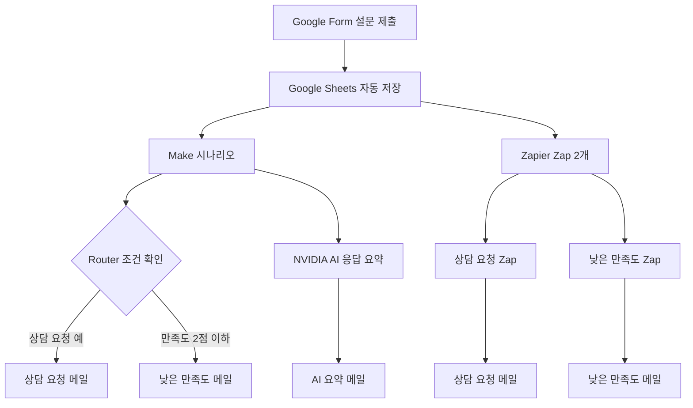

# Project 03. Google Form 기반 프로그램 만족도 조사 및 상담 신청 노코드 자동화

## 1. 프로젝트 개요

본 프로젝트는 Google Form으로 프로그램 만족도 조사와 상담 신청을 수집하고, Google Sheets와 Make를 연동하여 반복 업무를 자동화하는 것을 목표로 한다. 상담 신청이나 낮은 만족도 응답이 접수되면 담당자에게 Gmail로 자동 알림을 전송하도록 구현한다.

---

## 2. 자동화가 필요한 이유

| 기존 업무         | 자동화 후     |
| ------------- | --------- |
| 설문을 수동 확인     | 응답 즉시 저장  |
| 상담 신청자를 직접 확인 | 자동 이메일 발송 |
| 응답 누락 가능      | 조건별 자동 분류 |
| 처리 지연         | 즉시 대응 가능  |

## 3. 사용 도구

| 구분 | 사용 도구 | 역할 |
|---|---|---|
| 설문 수집 | Google Forms | 만족도 및 상담 요청 수집 |
| 데이터 저장 | Google Sheets | 응답 내용 기록 |
| 자동화 도구 1 | Make | 자동화 구현 |
| 자동화 도구 2 | Zapier | 동일한 자동화 구현 |
| 알림 | Gmail | 담당자 알림 전송 |

## 4. Google Form 설계

프로그램 만족도 조사와 상담 신청을 하나의 Google Form으로 구성하였다.

| 문항 | 형식 | 활용 목적 |
|---|---|---|
| 참여자 성함 | 단답형 | 응답자 구분 |
| 이메일 주소 | 단답형 | 필요시 상담 연락 |
| 참여 프로그램 | 드롭다운 | 프로그램별 응답 분류 |
| 참여 날짜 | 날짜 | 참여 일자 기록 |
| 프로그램 만족도 | 1~5점 | 낮은 만족도 응답 판별 |
| 개선사항 | 장문형 | 프로그램 개선 의견 수집 및 AI 요약 |
| 상담 필요 여부 | 예/아니요 | 상담 요청 응답 판별 |
| 상담 내용 | 장문형 | 상담 요청 내용 확인 |

프로그램 만족도 조사와 상담 신청을 하나의 폼으로 구성하였다.

### 입력 항목

- 참여자 성함
- 이메일 주소
- 참여 프로그램
- 참여 날짜
- 프로그램 만족도(1~5점)
- 개선사항
- 상담 필요 여부
- 상담 내용

### 설계 목적

- 만족도 데이터 자동 수집
- 상담 신청자 자동 분류
- Google Sheets 연동
- Gmail 자동 알림
- 향후 통계 분석 활용

[Google Form](https://forms.gle/aSaaMqjpnfSsThc76)

## 5. 자동화 조건

| 조건 | 처리 결과 |
|---|---|
| 상담 필요 여부가 `예` | 담당자에게 상담 요청 알림 메일 발송 |
| 프로그램 만족도가 `2점 이하` | 담당자에게 낮은 만족도 알림 메일 발송 |
| 개선사항이 입력됨 | NVIDIA AI가 응답 내용을 요약해 이메일 발송 |
| 위 조건에 해당하지 않음 | Google Sheets에만 응답 저장 |

Make에서는 Router를 이용해 조건별 경로를 구성하였다.

Zapier에서는 다중 분기 기능인 Paths가 유료 플랜에서 제공되기 때문에, 무료 플랜에서 동일한 Google Sheets를 감지하는 Zap을 두 개로 나누어 구현하였다.

## 6. 워크플로우

## 7. Make 구현 결과

### 조건별 분기 설정

### Make 시나리오 구성

1. Google Sheets의 신규 응답 감지
2. Router를 이용한 조건 분기
3. 상담 필요 여부가 `예`인 응답 판별
4. 만족도가 `2점 이하`인 응답 판별
5. 조건에 따라 Gmail 알림 발송
6. NVIDIA AI를 이용한 개선사항 요약
7. AI 요약 결과를 Gmail로 발송

### 구현 방식

Make의 `Google Sheets - Watch New Rows` 모듈을 시작점으로 설정하였다.  

### 전체 자동화 구성

 

Rou 8. Zapier 구현 결과

### 구현 방식

Zapier 무료 플랜에서는 여러 조건을 나누는 Paths 기능을 사용할 수 없어, 동일한 Google Sheets를 감지하는 Zap을 두 개로 구성하였다.

| Zap | Filter 조건 | 실행 결과 |
|---|---|---|
| 상담 요청 Zap | 상담 필요 여부가 `예` | 상담 요청 알림 메일 발송 |
| 낮은 만족도 Zap | 만족도가 `3 미만` | 1~2점 응답에 알림 메일 발송 |

두 Zap은 각각 다음 구조로 구성하였다.

`Google Sheets → Filter by Zapier → Gmail`

### 무료 플랜 제약 해결

유료 기능인 Paths를 사용하지 않고 Zap을 두 개로 복제한 뒤, 각각 다른 Filter 조건을 적용하였다. 이를 통해 무료 플랜에서도 두 가지 조건을 독립적으로 처리할 수 있었다.

### 테스트 결과

| 테스트 조건 | 결과 |
|---|---|
| 상담 요청 `예`, 만족도 3점 | 상담 요청 메일 발송 성공 |
| 상담 요청 `아니요`, 만족도 2점 | 낮은 만족도 메일 발송 성공 |
| 두 Zap 활성화 상태 | 정상 작동 확인 |

### 주요 구현 화면

## 9. Make와 Zapier 비교

| 비교 항목 | Make | Zapier |
|---|---|---|
| 자동화 구성 | 하나의 시나리오에서 Router로 분기 | 무료 플랜에서는 Zap 2개로 분리 |
| 조건 설정 | Filter와 Router 사용 | Filter by Zapier 사용 |
| 사용 난이도 | 구조가 복잡하지만 세부 설정 가능 | 단계가 단순해 초보자가 이해하기 쉬움 |
| 화면 이해도 | 전체 흐름을 한 화면에서 확인 가능 | 단계별 설정이 명확함 |
| 무료 플랜 제약 | 실행 횟수와 확인 주기 제한 | Paths 등 일부 분기 기능 제한 |
| AI 연동 | HTTP 모듈로 외부 AI API 연동 가능 | 이번 프로젝트에서는 구현하지 않음 |
| 오류 확인 | 모듈별 실행 결과를 상세하게 확인 가능 | 단계별 테스트 결과 확인이 쉬움 |
| 적합한 활용 | 복잡하거나 확장 가능한 업무 | 비교적 단순한 자동 알림 업무 |

### 비교 결과

비전공자가 기본적인 자동 알림을 빠르게 구현하는 데에는 Zapier가 상대적으로 쉬웠다. 반면 Make는 Router와 HTTP 모듈을 이용해 조건 분기와 외부 AI 기능을 하나의 시나리오에 구성할 수 있어 확장성이 더 높았다. 

## 10. 통합 테스트 결과

Make와 Zapier를 동일한 Google Sheets에 연결하고, Google Form 응답 한 건을 제출하여 전체 자동화가 동시에 작동하는지 확인하였다.

### 최종 테스트 조건

- 테스트 참여자: 가상 데이터 사용
- 프로그램 만족도: 2점
- 상담 필요 여부: 예
- 개선사항: AI 요약 테스트용 문장 입력

| 확인 항목 | 결과 |
|---|---|
| Google Form 응답 제출 | ✅ 성공 |
| Google Sheets 신규 행 저장 | ✅ 성공 |
| Make 상담 요청 메일 | ✅ 성공 |
| Make 낮은 만족도 메일 | ✅ 성공 |
| Zapier 상담 요청 메일 | ✅ 성공 |
| Zapier 낮은 만족도 메일 | ✅ 성공 |
| NVIDIA AI 응답 요약 | ✅ 성공 |
| AI 요약 이메일 발송 | ✅ 성공 |

## 11. NVIDIA AI 보너스 기능

기본 자동화에 생성형 AI 기능을 추가하여 설문 응답의 개선사항을 요약하도록 구현하였다.

### 처리 과정

1. Google Sheets에서 신규 응답 확인
2. 응답자의 개선사항을 NVIDIA AI API로 전달
3. AI가 핵심 내용을 짧게 요약
4. 생성된 요약문을 Gmail로 발송

### 구현 결과

HTTP 모듈의 JSON 본문 구성 과정에서 문자열 매핑 오류가 발생했으나, 요청 형식과 매핑값을 수정하여 최종적으로 AI 요약문이 포함된 이메일 발송에 성공하였다.

## 12. 구현 중 발생한 문제와 해결 방법

| 문제 | 원인 | 해결 방법 |
|---|---|---|
| Make가 신규 응답을 바로 감지하지 않음 | 스케줄링 기능이 꺼져 있었음 | 스케줄링을 켜고 15분마다 확인하도록 설정 |
| Zapier에서 두 조건을 한 번에 분기하기 어려움 | Paths가 유료 기능임 | Zap을 두 개로 복제하여 조건별로 구성 |
| NVIDIA API 요청 오류 | JSON 본문에 매핑값을 넣는 과정에서 형식 오류 발생 | JSON 구조와 문자열 매핑 방식을 수정 |
| AI 요약 메일 내용이 비어 있음 | API 응답값의 잘못된 항목을 Gmail에 매핑 | 실제 요약 결과가 들어 있는 응답 필드를 다시 연결 |

## 13. 실제 구동 영상

Make와 Zapier를 동일한 Google Sheets에 연결하고, 하나의 설문 응답으로 두 자동화 도구와 NVIDIA AI 기능을 동시에 테스트하였다.

> 통합 구동 영상 편집 후 공유 링크 추가 예정

## 14. 기대 효과 및 활용 가능성

### 1. 기대 효과

- **설문 확인 업무 감소**  
  담당자가 Google Sheets를 반복적으로 확인하지 않아도 조건에 해당하는 응답을 이메일로 바로 확인할 수 있다.

- **상담 요청의 신속한 대응**  
  상담 필요 여부가 `예`인 응답을 자동으로 분류하고 알림을 발송하여 상담 요청 누락과 대응 지연을 줄일 수 있다.

- **낮은 만족도 응답의 조기 발견**  
  만족도 2점 이하의 응답을 자동으로 감지하여 프로그램 운영상의 문제를 빠르게 확인하고 개선할 수 있다.

- **장문 응답 확인 시간 단축**  
  NVIDIA AI가 개선사항을 요약해 담당자에게 전달하므로, 설문 응답이 많아져도 핵심 의견을 빠르게 파악할 수 있다.

- **업무 정확성 향상**  
  사람이 설문 응답을 일일이 확인하고 분류하는 과정에서 발생할 수 있는 누락이나 분류 오류를 줄일 수 있다.

### 2. 활용 가능성

본 자동화는 프로그램 만족도 조사뿐만 아니라 다음과 같은 업무에도 활용할 수 있다.

| 활용 분야 | 적용 방법 |
|---|---|
| 교육 프로그램 | 수업 만족도, 보충수업 요청, 학습 상담 신청 알림 |
| 복지기관 | 서비스 만족도 조사, 긴급 지원 및 상담 요청 접수 |
| 사회적협동조합 | 참여자 의견 수집, 프로그램 개선사항 관리 |
| 행사·체험 프로그램 | 행사 만족도 및 불편 사항 자동 분류 |
| 고객 관리 | 낮은 만족도 고객과 문의 고객의 신속한 확인 |
| 내부 업무 | 직원 의견 조사, 시설 고장 및 업무 요청 접수 |

### 3. 향후 확장 가능성

- 상담 요청 내용을 담당자별로 자동 배정
- 긴급도에 따라 이메일 제목과 알림 우선순위 구분
- Google Sheets 대시보드를 이용한 만족도 통계 시각화
- 반복적으로 등장하는 개선사항을 AI로 분류하고 요약
- Gmail 외에 Slack, 카카오워크 등 다른 알림 도구 연동
- 상담 처리 여부와 후속 조치 결과를 기록하는 관리 기능 추가

이번 프로젝트는 단순한 이메일 알림에서 끝나는 것이 아니라, 향후 설문 수집부터 분류, 요약, 담당자 전달, 사후 관리까지 연결되는 통합 업무 자동화 시스템으로 확장할 수 있다.

## 15. 결론

이번 프로젝트에서는 Google Form으로 수집한 프로그램 만족도와 상담 요청을 Google Sheets에 자동 저장하고, Make와 Zapier를 이용해 조건별 이메일 알림을 발송하였다.

Zapier에서는 무료 플랜의 기능 제한을 고려하여 두 개의 Zap으로 조건을 분리했고, Make에서는 Router를 이용해 하나의 시나리오 안에서 조건을 처리하였다. 또한 NVIDIA AI를 연동하여 개선사항을 요약하는 기능까지 확장하였다.

이를 통해 담당자가 설문지를 반복적으로 확인하지 않아도 상담 요청과 낮은 만족도 응답을 빠르게 확인할 수 있었다.

## 16. 개인정보 및 보안

과제 테스트에는 실제 학생 정보가 아닌 가상 데이터를 사용하였다.
API Key, 비밀번호, 개인 이메일 주소는 공개하지 않았다.
