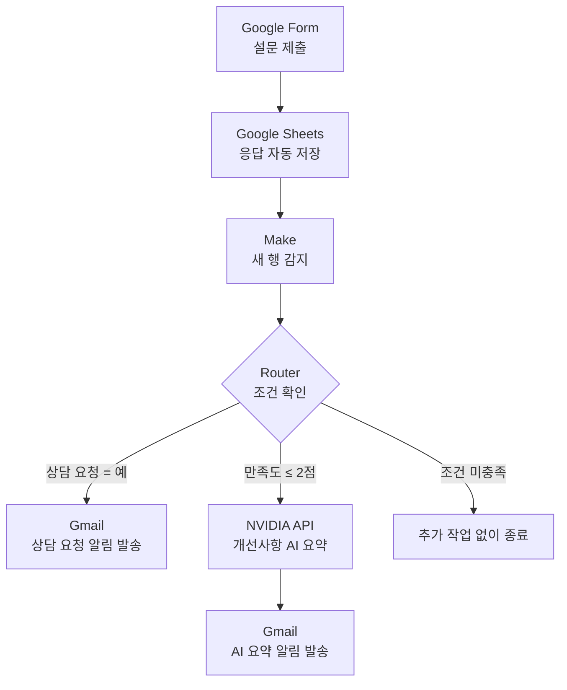
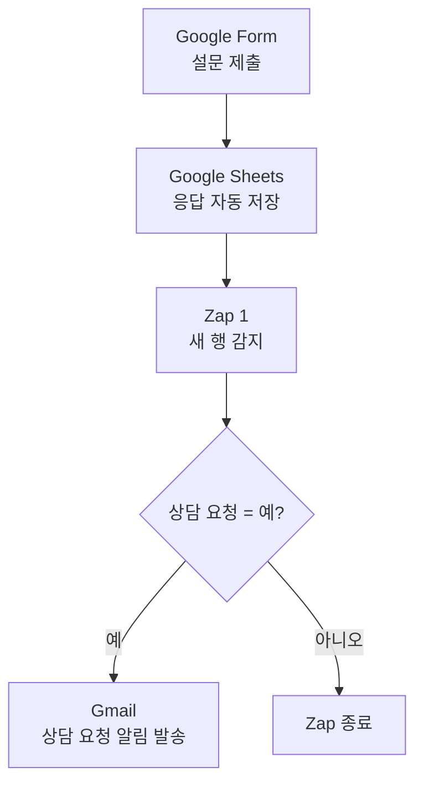
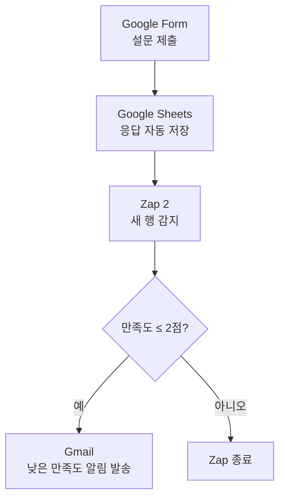

# Project 03. Google Form 기반 프로그램 만족도 조사 및 상담 신청 노코드 자동화

> Google Form 응답을 Google Sheets에 저장하고, Make와 Zapier를 이용해 상담 요청과 낮은 만족도 응답을 자동으로 분류·알림하는 프로젝트입니다. 보너스 기능으로 NVIDIA 생성형 AI API를 연동해 개선 의견을 요약한 이메일도 발송합니다.

## 1. 프로젝트 개요

본 프로젝트는 Google Form으로 프로그램 만족도 조사와 상담 신청을 수집하고, Google Sheets와 Make를 연동하여 반복 업무를 자동화하는 것을 목표로 한다. 상담 신청이나 낮은 만족도 응답이 접수되면 담당자에게 Gmail로 자동 알림을 전송하도록 구현한다.

---

## 2. 자동화가 필요한 이유

| 기존 업무         | 자동화 후     |
| ------------- | --------- |
| 설문을 수동 확인     | 응답 즉시 저장  |
| 상담 신청자를 직접 확인 | 자동 이메일 발송 |
| 응답 누락 가능      | 조건별 자동 분류 |
| 처리 지연         | 즉시 대응 가능  |

## 3. 사용 도구

| 구분 | 사용 도구 | 역할 |
|---|---|---|
| 설문 수집 | Google Forms | 만족도 및 상담 요청 수집 |
| 데이터 저장 | Google Sheets | 응답 내용 기록 |
| 자동화 도구 1 | Make | 자동화 구현 |
| 자동화 도구 2 | Zapier | 동일한 자동화 구현 |
| 알림 | Gmail | 담당자 알림 전송 |

## 4. Google Form 설계

프로그램 만족도 조사와 상담 신청을 하나의 Google Form으로 구성하였다.

| 문항 | 형식 | 활용 목적 |
|---|---|---|
| 참여자 성함 | 단답형 | 응답자 구분 |
| 이메일 주소 | 단답형 | 필요시 상담 연락 |
| 참여 프로그램 | 드롭다운 | 프로그램별 응답 분류 |
| 참여 날짜 | 날짜 | 참여 일자 기록 |
| 프로그램 만족도 | 1~5점 | 낮은 만족도 응답 판별 |
| 개선사항 | 장문형 | 프로그램 개선 의견 수집 및 AI 요약 |
| 상담 필요 여부 | 예/아니요 | 상담 요청 응답 판별 |
| 상담 내용 | 장문형 | 상담 요청 내용 확인 |

프로그램 만족도 조사와 상담 신청을 하나의 폼으로 구성하였다.

### 입력 항목

- 참여자 성함
- 이메일 주소
- 참여 프로그램
- 참여 날짜
- 프로그램 만족도(1~5점)
- 개선사항
- 상담 필요 여부
- 상담 내용

### 설계 목적

- 만족도 데이터 자동 수집
- 상담 신청자 자동 분류
- Google Sheets 연동
- Gmail 자동 알림
- 향후 통계 분석 활용

[Google Form](https://forms.gle/aSaaMqjpnfSsThc76)

## 5. 자동화 조건

| 구분 | 실행 조건 | 처리 결과 |
|---|---|---|
| 상담 요청 알림 | 상담 필요 여부가 `예` | 담당자에게 상담 요청 이메일 발송 |
| 낮은 만족도 알림 | 프로그램 만족도가 `2점 이하` | 담당자에게 낮은 만족도 이메일 발송 |
| AI 요약 알림 | 프로그램 만족도가 `2점 이하` | NVIDIA AI가 개선사항을 요약해 이메일 발송 |
| 조건 미충족 | 상담 요청이 아니고 만족도가 3점 이상 | Google Sheets에만 저장 후 종료 |

기본 Make 시나리오에서는 상담 요청 메일과 일반 낮은 만족도 메일을 구현하였다. 보너스 확장 시나리오에서는 낮은 만족도 분기의 일반 메일을 `NVIDIA API 요약 → AI 요약 메일` 흐름으로 확장하였다.

최종 자동 실행에는 NVIDIA AI가 포함된 확장 시나리오를 사용하고, 기본 Make 시나리오는 구현 과정과 비교를 위한 증빙으로 보관하였다. 이 방식으로 동일 응답에 일반 낮은 만족도 메일과 AI 요약 메일이 중복 발송되는 것을 방지하였다.

## 6. 워크플로우

## 1. Make 최종 자동화 흐름도

Google Form으로 제출된 설문 응답은 Google Sheets에 자동 저장된다.  
저장된 응답을 바탕으로 Make와 Zapier에서 조건별 이메일 알림을 실행하도록 구성하였다.

---

### 6.1 Make 최종 확장 시나리오

Make에서는 하나의 시나리오 안에 Router를 추가하여 두 가지 조건으로 응답을 분기하였다.

- 상담 요청이 `예`인 경우: 상담 요청 알림 이메일 발송
- 만족도가 `2점 이하`인 경우: NVIDIA AI가 개선사항을 요약한 후 이메일 발송

### Make 처리 조건

| 분기 | 실행 조건 | 처리 내용 |
|---|---|---|
| 상담 요청 알림 | 상담 요청 = 예 | 설문 응답과 연락처를 상담 담당자에게 이메일로 발송 |
| AI 요약 알림 | 만족도 ≤ 2점 | NVIDIA AI가 개선사항을 요약한 후 이메일로 발송 |
| 미처리 | 두 조건 모두 미충족 | 별도의 이메일을 발송하지 않고 종료 |

상담 요청이 `예`이면서 만족도가 `2점 이하`인 경우에는 두 분기가 각각 실행되어 상담 요청 이메일과 AI 요약 이메일이 모두 발송된다.

---

### 6.2 Zapier 최종 자동화

Zapier 무료 플랜에서는 하나의 Zap 안에서 여러 조건으로 분기하는 Paths 기능을 사용할 수 없어, 상담 요청 알림과 낮은 만족도 알림을 각각 별도의 Zap으로 구성하였다.

### Zap 1: 상담 요청 알림

### Zap 2: 낮은 만족도 알림

### Zapier 처리 조건

| Zap | 실행 조건 | 처리 내용 |
|---|---|---|
| Zap 1 | 상담 요청 = 예 | 상담 요청 알림 이메일 발송 |
| Zap 2 | 만족도 ≤ 2점 | 낮은 만족도 알림 이메일 발송 |

상담 요청이 `예`이면서 만족도가 `2점 이하`인 경우에는 두 개의 Zap이 각각 실행되어 이메일 두 통이 발송된다.

---

### 6.3 Make와 Zapier 구성 차이

| 구분 | Make | Zapier |
|---|---|---|
| 자동화 구성 | 하나의 시나리오에서 Router로 분기 | 조건별로 Zap 2개 구성 |
| 상담 요청 처리 | 상담 요청 이메일 발송 | 상담 요청 이메일 발송 |
| 낮은 만족도 처리 | NVIDIA AI 요약 후 이메일 발송 | 일반 낮은 만족도 이메일 발송 |
| AI 기능 | NVIDIA API 연동 | 적용하지 않음 |
| 동시 조건 충족 | 두 분기가 각각 실행됨 | 두 Zap이 각각 실행됨 |

## 7. Make 구현 결과

### 조건별 분기 설정

### Make 시나리오 구성

1. Google Sheets의 신규 응답 감지
2. Router를 이용한 조건 분기
3. 상담 필요 여부가 `예`인 응답 판별
4. 만족도가 `2점 이하`인 응답 판별
5. 조건에 따라 Gmail 알림 발송
6. NVIDIA AI를 이용한 개선사항 요약
7. AI 요약 결과를 Gmail로 발송

### 구현 방식

Make의 `Google Sheets - Watch New Rows` 모듈을 시작점으로 설정하였다.  

### Make 전체 자동화 구성

#### 1. 상담 요청 조건이 포함된 Google Form

#### 2. Google Form 응답이 저장된 Google Sheets

#### 3. Google Sheets 새 응답 감지 모듈 설정

#### 4. Google Sheets 새 응답 감지 테스트 성공

#### 5. 조건별 처리를 위한 Router 추가

#### 6. 상담 요청 응답 필터 설정

#### 7. 상담 요청 이메일 내용 매핑

#### 8. 상담 요청 이메일 수신 결과

#### 9. 낮은 만족도 응답 필터 설정

#### 10. 낮은 만족도 이메일 수신 결과

#### 11. 두 조건 동시 충족 테스트 결과

#### 12. Make 기본 자동화 최종 시나리오

## 8. Zapier 구현 결과

### 구현 방식

Zapier에서는 Paths를 사용하지 않고, 상담 요청과 낮은 만족도 조건을 각각 별도의 Zap으로 구성하였다. Filter가 포함된 다단계 Zap 실행에는 14일 Professional 체험 기능을 활용하였다.

| Zap | Filter 조건 | 실행 결과 |
|---|---|---|
| 상담 요청 Zap | 상담 필요 여부가 `예` | 상담 요청 알림 메일 발송 |
| 낮은 만족도 Zap | 만족도가 `3 미만` | 1~2점 응답에 알림 메일 발송 |

두 Zap은 각각 다음 구조로 구성하였다.

`Google Sheets → Filter by Zapier → Gmail`

### 플랜 제약과 구현 방법

Paths를 사용하지 않고 Zap을 두 개로 나눈 뒤 각각 다른 Filter 조건을 적용하였다.

다만 이번에 구현한 `Google Sheets → Filter by Zapier → Gmail` 구성은 Filter가 포함된 다단계 Zap이다. 따라서 14일 Professional 체험 기능을 활용했으며, 체험 종료 후 Zapier Free 플랜으로 전환하면 해당 구성의 계속 사용이 제한될 수 있다.

### 테스트 결과

| 테스트 조건 | 결과 |
|---|---|
| 상담 요청 `예`, 만족도 3점 | 상담 요청 메일 발송 성공 |
| 상담 요청 `아니요`, 만족도 2점 | 낮은 만족도 메일 발송 성공 |
| 두 Zap 활성화 상태 | 정상 작동 확인 |

### Zapier 전체 자동화 구성

Zapier 무료 플랜에서는 Paths 기능을 사용할 수 없어, 조건별로 두 개의 Zap을 각각 구성하였다.

- 상담 요청이 `예`인 경우: 상담 요청 알림 이메일 발송
- 만족도가 `2점 이하`인 경우: 낮은 만족도 알림 이메일 발송

#### 1. Google Sheets 트리거 계정 연결

#### 2. 설문 응답 스프레드시트 및 워크시트 선택

#### 3. Google Sheets 트리거 테스트

#### 4. 자동화 테스트용 설문 응답 선택

#### 5. Gmail 알림 이메일 본문 매핑

#### 6. 조건별 Zap 2개 활성화

#### 7. 상담 요청 응답 필터 설정

#### 8. 낮은 만족도 응답 필터 설정

#### 9. 상담 요청 알림 Zap 전체 구성

#### 10. 낮은 만족도 알림 Zap 전체 구성

#### 11. 상담 요청 알림 이메일 수신 결과

#### 12. 낮은 만족도 알림 이메일 수신 결과

## 9. Make와 Zapier 비교

동일한 Google Form 설문 응답 자동화 업무를 Make와 Zapier로 각각 구현하고, 기능·비용·대량 처리·사업화 가능성을 비교하였다.

### 종합 비교표

| 비교 항목 | Make | Zapier |
|---|---|---|
| 자동화 구성 방식 | 하나의 시나리오 안에서 Router를 이용해 여러 조건으로 분기 | 무료 플랜에서는 조건별 Zap을 각각 생성 |
| 이번 과제의 구성 | 상담 요청 알림과 NVIDIA AI 요약을 하나의 시나리오로 구현 | 상담 요청 Zap과 일반 낮은 만족도 Zap을 2개로 분리 |
| 무료 플랜 제공량 | 월 1,000 credits | 월 100 tasks |
| 유료 플랜 시작 가격 | Core 플랜 월 $12부터 | Professional 플랜 월 $19.99부터 |
| 무료 플랜의 주요 제약 | 실행 간격이 최소 15분이며 월간 credit 제한이 있음 | 2단계 Zap만 지원하며 다단계 Zap은 유료 플랜 필요 |
| 사용량 계산 방식 | 일반 모듈 실행 1회당 기본적으로 1 credit 사용 | 성공적으로 실행된 Action 단계마다 일반적으로 1 task 사용 |
| 조건 분기 | Router와 Filter로 하나의 시나리오 안에서 구현 가능 | Paths와 다단계 Zap은 유료 플랜에서 지원 |
| AI·외부 API 연동 | HTTP 모듈을 이용해 NVIDIA API 등 외부 서비스 연동 가능 | Webhook과 다단계 연동은 주로 유료 플랜에서 활용 |
| 화면 구성 | 흐름 전체가 시각적으로 표시되어 복잡한 구조를 파악하기 쉬움 | 단계별 설정 방식이 단순하여 초보자가 접근하기 쉬움 |
| 초기 설정 난이도 | Router, Filter, 데이터 매핑 등 학습이 필요함 | 기본 자동화는 비교적 쉽게 만들 수 있음 |
| 오류 확인 | 모듈별 입력값과 출력값을 상세하게 확인 가능 | 단계별 테스트 결과와 오류 메시지를 확인하기 쉬움 |
| 유지·수정 | 하나의 시나리오에서 전체 흐름을 관리하기 편리함 | Zap 수가 늘어나면 각각 수정하고 관리해야 함 |
| 대량 처리 적합성 | 상대적으로 많은 무료 credits와 세밀한 분기 기능을 제공하여 유리함 | 무료 tasks가 적어 반복 실행량이 많으면 유료 전환이 빠르게 필요함 |
| 확장성 | 복잡한 분기, 데이터 가공, API 연동 등 고급 자동화에 적합 | 다양한 앱을 빠르고 간단하게 연결하는 업무에 적합 |
| 비전공자 구현 가능성 | 기본 개념을 익히는 데 시간이 필요하지만 시각적 구조를 통해 확장 가능 | 간단한 2단계 자동화는 비전공자도 비교적 쉽게 구현 가능 |
| 사업화 가능성 | 고객별 복잡한 업무 자동화와 맞춤형 API 연동 서비스에 적합 | 소규모 사업자의 단순 반복 업무를 빠르게 구축하는 서비스에 적합 |
| 이번 과제 적합성 | 조건 분기와 NVIDIA AI 연동까지 하나의 흐름으로 구현할 수 있어 더 적합 | 기본 이메일 알림 자동화를 빠르게 구현하고 비교하는 데 적합 |

### 가격 및 대량 처리 비교

2026년 8월 공식 요금표 기준으로 Make 무료 플랜은 월 1,000 credits를 제공하고, Zapier 무료 플랜은 월 100 tasks를 제공한다. 유료 플랜은 Make Core가 월 $12부터, Zapier Professional이 월 $19.99부터 시작한다. 실제 결제 금액은 선택한 사용량, 결제 주기, 환율 및 부가세에 따라 달라질 수 있다.

Make에서는 일반적으로 실행된 모듈마다 credit이 사용된다. 따라서 하나의 설문 응답을 처리하더라도 Google Sheets 감지, Gmail 발송, HTTP 요청 등 실행되는 모듈 수에 따라 여러 credits가 필요할 수 있다. Router와 Filter 자체는 credit을 사용하지 않지만, 분기 이후 실행되는 모듈은 각각 사용량에 포함된다.

Zapier에서는 Trigger가 아니라 성공적으로 실행된 Action을 중심으로 task가 계산된다. 이번 과제처럼 Gmail 발송 Action이 실행되면 task가 사용되며, 두 조건을 동시에 충족하여 두 개의 Zap이 모두 실행되면 각각 task가 계산될 수 있다.

따라서 무료 제공량만 단순 비교할 수는 없지만, 설문 응답이 많고 처리 단계가 복잡해질수록 Make가 비용과 구성 면에서 상대적으로 유리할 가능성이 크다. 반면 처리량이 많지 않고 단순한 앱 연결이 목적이라면 Zapier가 더 쉽게 활용될 수 있다.

### 사업화 가능성

#### Make 활용 방안

- 고객 문의와 상담 신청을 조건별 담당자에게 자동 전달
- 만족도가 낮은 응답을 AI로 요약하여 관리자에게 보고
- 여러 지점이나 기관의 설문 결과를 하나의 시나리오에서 분류
- 외부 API와 연결하여 번역, 요약, 분석 등 맞춤형 기능 제공
- 고객별 업무 흐름을 설계하는 자동화 구축·관리 서비스로 확장

Make는 복잡한 조건 분기와 외부 API 연동이 가능하므로, 기업이나 기관을 대상으로 한 맞춤형 자동화 서비스에 적합하다. 다만 시나리오 설계와 오류 관리에 대한 학습이 필요하다.

#### Zapier 활용 방안

- 설문 제출 시 담당자에게 알림 이메일 발송
- 신청서나 문의 내용을 다른 업무 앱으로 전달
- 소규모 사업자의 단순 반복 업무 자동화
- 복잡한 개발 없이 여러 SaaS 서비스를 빠르게 연결
- 간단한 자동화 구축과 사용 교육 서비스로 활용

Zapier는 사용 방법이 비교적 단순하고 지원하는 앱이 많아, 자동화를 처음 도입하는 소규모 사업자에게 적합하다. 그러나 처리량과 단계가 늘어나면 유료 플랜 비용과 여러 Zap의 관리 부담을 함께 고려해야 한다.

### 최종 평가

이번 과제에서는 Make가 하나의 시나리오 안에서 두 가지 조건을 분기하고 NVIDIA AI까지 연결할 수 있어 기능 확장성과 사업화 측면에서 더 적합하였다. Zapier는 상담 요청과 낮은 만족도 알림을 각각 별도의 Zap으로 구성해야 했지만, 설정 과정이 단순하여 비전공자가 기본 자동화 구조를 익히는 데 유리하였다.

따라서 단순하고 빠른 자동화에는 Zapier가 적합하고, 복잡한 조건 처리·대량 처리·AI 및 외부 API 연동이 필요한 업무에는 Make가 더 적합하다고 판단하였다.

> 가격 및 제공량 확인 기준: 2026년 8월 1일  
> 공식 자료: [Make 요금제](https://www.make.com/en/pricing), [Make credit 안내](https://help.make.com/credits), [Zapier 요금제](https://zapier.com/pricing), [Zapier 무료 플랜 안내](https://help.zapier.com/hc/en-us/articles/32337438839565-What-s-included-in-Zapier-s-Free-plan)

## 10. 통합 테스트 결과

Google Form에 테스트 응답을 제출한 뒤 Google Sheets 저장, Make·Zapier 조건 분기, NVIDIA AI 요약, Gmail 수신까지 확인하였다.

### 10.1 최종 테스트 조건

- 테스트 데이터: 실제 학생 정보가 아닌 가상 정보
- 프로그램 만족도: 2점
- 상담 필요 여부: 예
- 개선사항: AI 요약 확인용 문장 입력

### 10.2 확인 결과

| 확인 항목 | 결과 |
|---|:---:|
| Google Form 응답 제출 | ✅ 성공 |
| Google Sheets 신규 행 저장 | ✅ 성공 |
| Make 상담 요청 조건 분기 | ✅ 성공 |
| Make 기본 낮은 만족도 알림 | ✅ 개별 테스트 성공 |
| NVIDIA API HTTP 응답 | ✅ 200 성공 |
| Make AI 요약 이메일 발송 | ✅ 성공 |
| Zapier 상담 요청 Zap | ✅ 성공 |
| Zapier 낮은 만족도 Zap | ✅ 성공 |

최종 자동 실행에서는 Make의 NVIDIA 확장 시나리오와 Zapier의 Zap 2개를 사용하였다. 만족도 2점·상담 요청 `예`인 응답의 경우 Make에서 상담 요청 메일과 AI 요약 메일이, Zapier에서 상담 요청 메일과 낮은 만족도 메일이 발송된다.

## 11. NVIDIA AI 보너스 기능

기본 자동화에 생성형 AI 기능을 추가하여 설문 응답의 개선사항을 요약하도록 구현하였다.

### 처리 과정

1. Google Sheets에서 신규 응답 확인
2. 응답자의 개선사항을 NVIDIA AI API로 전달
3. AI가 핵심 내용을 짧게 요약
4. 생성된 요약문을 Gmail로 발송

### 구현 결과

HTTP 모듈의 JSON 본문 구성 과정에서 문자열 매핑 오류가 발생했으나, 요청 형식과 매핑값을 수정하여 최종적으로 AI 요약문이 포함된 이메일 발송에 성공하였다.

#### 1. NVIDIA AI 모델 및 프롬프트 설정

#### 2. Google Form 설문 응답 데이터 매핑

#### 3. NVIDIA AI가 포함된 Make 시나리오 실행 성공

#### 4. NVIDIA AI 응답 요약 결과 생성

#### 5. NVIDIA API 응답과 Gmail 본문 연결

#### 6. AI 요약 이메일 수신 결과

## 12. 구현 중 발생한 문제와 해결 방법

| 문제 | 원인 | 해결 방법 |
|---|---|---|
| Make가 신규 응답을 바로 감지하지 않음 | 스케줄링이 꺼져 있거나 시작 행 위치가 맞지 않음 | 시작 위치를 확인하고 15분 스케줄링 활성화 |
| 상담 요청 메일이 중복 발송됨 | Run once 테스트와 예약 실행이 겹치거나 여러 시나리오가 같은 행을 처리 | 테스트 중에는 스케줄을 끄고, 최종 확장 시나리오 하나만 자동 실행 |
| Zapier에서 두 조건을 한 Zap으로 분기하기 어려움 | Paths와 다단계 Zap이 유료 기능 | 체험 기간에 조건별 Zap 2개로 분리해 구현하고 플랜 제약 명시 |
| NVIDIA API가 HTTP 400 오류를 반환 | JSON 본문 안의 매핑값과 문자열 형식 오류 | 요청 JSON 구조와 매핑 문법 수정 |
| AI 요약 메일 내용이 비어 있음 | Gmail 본문에 API 응답의 잘못된 필드 연결 | 실제 요약문이 담긴 응답 필드로 다시 매핑 |
| AI 메일만으로 응답 출처를 확인하기 어려움 | 메일 본문에 설문 정보와 처리 경로가 부족함 | 참여자·프로그램·만족도·상담 여부·개선사항 원문·AI 요약을 함께 표시 |

## 13. 실제 구동 영상

Google Form 응답 제출부터 Google Sheets 저장, Make·Zapier 자동 실행, NVIDIA AI 요약, Gmail 수신까지의 전체 과정을 영상으로 기록하였다.

[▶ B1-3 노코드 자동화 통합 구동 영상 보기](https://drive.google.com/file/d/13uUxRT3v-8brCVdBSr25-NIUGEE5c_f5/view)

## 14. 기대 효과 및 활용 가능성

### 1. 기대 효과

- **설문 확인 업무 감소**  
  담당자가 Google Sheets를 반복적으로 확인하지 않아도 조건에 해당하는 응답을 이메일로 바로 확인할 수 있다.

- **상담 요청의 신속한 대응**  
  상담 필요 여부가 `예`인 응답을 자동으로 분류하고 알림을 발송하여 상담 요청 누락과 대응 지연을 줄일 수 있다.

- **낮은 만족도 응답의 조기 발견**  
  만족도 2점 이하의 응답을 자동으로 감지하여 프로그램 운영상의 문제를 빠르게 확인하고 개선할 수 있다.

- **장문 응답 확인 시간 단축**  
  NVIDIA AI가 개선사항을 요약해 담당자에게 전달하므로, 설문 응답이 많아져도 핵심 의견을 빠르게 파악할 수 있다.

- **업무 정확성 향상**  
  사람이 설문 응답을 일일이 확인하고 분류하는 과정에서 발생할 수 있는 누락이나 분류 오류를 줄일 수 있다.

### 2. 활용 가능성

본 자동화는 프로그램 만족도 조사뿐만 아니라 다음과 같은 업무에도 활용할 수 있다.

| 활용 분야 | 적용 방법 |
|---|---|
| 교육 프로그램 | 수업 만족도, 보충수업 요청, 학습 상담 신청 알림 |
| 복지기관 | 서비스 만족도 조사, 긴급 지원 및 상담 요청 접수 |
| 사회적협동조합 | 참여자 의견 수집, 프로그램 개선사항 관리 |
| 행사·체험 프로그램 | 행사 만족도 및 불편 사항 자동 분류 |
| 고객 관리 | 낮은 만족도 고객과 문의 고객의 신속한 확인 |
| 내부 업무 | 직원 의견 조사, 시설 고장 및 업무 요청 접수 |

### 3. 향후 확장 가능성

- 상담 요청 내용을 담당자별로 자동 배정
- 긴급도에 따라 이메일 제목과 알림 우선순위 구분
- Google Sheets 대시보드를 이용한 만족도 통계 시각화
- 반복적으로 등장하는 개선사항을 AI로 분류하고 요약
- Gmail 외에 Slack, 카카오워크 등 다른 알림 도구 연동
- 상담 처리 여부와 후속 조치 결과를 기록하는 관리 기능 추가

이번 프로젝트는 단순한 이메일 알림에서 끝나는 것이 아니라, 향후 설문 수집부터 분류, 요약, 담당자 전달, 사후 관리까지 연결되는 통합 업무 자동화 시스템으로 확장할 수 있다.

## 15. 결론

이번 프로젝트에서는 Google Form으로 수집한 프로그램 만족도와 상담 요청을 Google Sheets에 자동 저장하고, Make와 Zapier를 이용해 조건별 이메일 알림을 발송하였다.

Zapier에서는 무료 플랜의 기능 제한을 고려하여 두 개의 Zap으로 조건을 분리했고, Make에서는 Router를 이용해 하나의 시나리오 안에서 조건을 처리하였다. 또한 NVIDIA AI를 연동하여 개선사항을 요약하는 기능까지 확장하였다.

이를 통해 담당자가 설문지를 반복적으로 확인하지 않아도 상담 요청과 낮은 만족도 응답을 빠르게 확인할 수 있었다.

## 16. 개인정보 및 보안

- 과제 테스트에는 실제 학생 정보가 아닌 가상 데이터를 사용하였다.
- NVIDIA API Key와 계정 비밀번호는 문서와 제출 이미지에 기록하지 않는다.
- 공개 저장소에 올리는 캡처는 개인 이메일 주소, 계정명, 프로필 이미지 등 식별 정보를 가림 처리한다.
- 실제 기관에 적용할 때는 개인정보 수집·이용 동의, 접근 권한, 보관 기간, 삭제 절차를 별도로 설정해야 한다.
- API Key는 Make의 연결·보안 설정에서 관리하고 코드나 공개 문서에 직접 입력하지 않는다.
