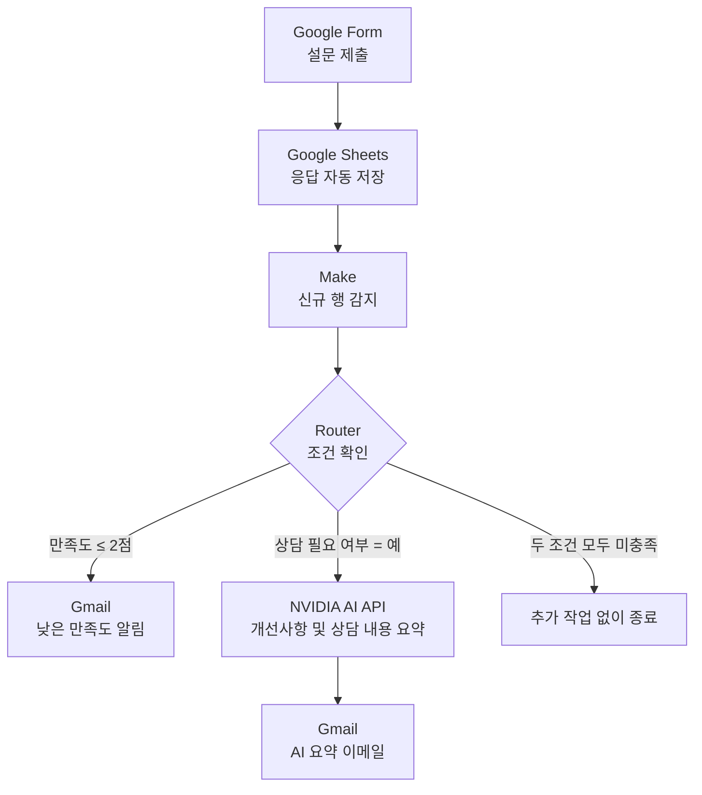
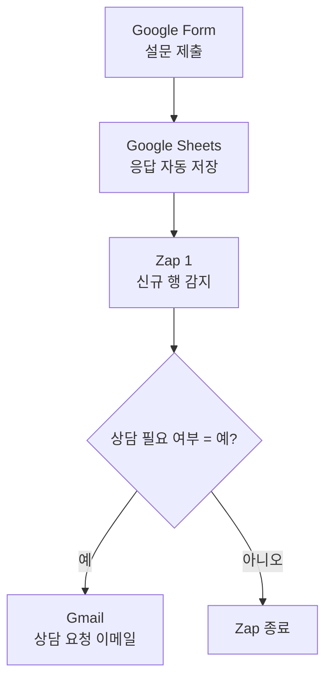
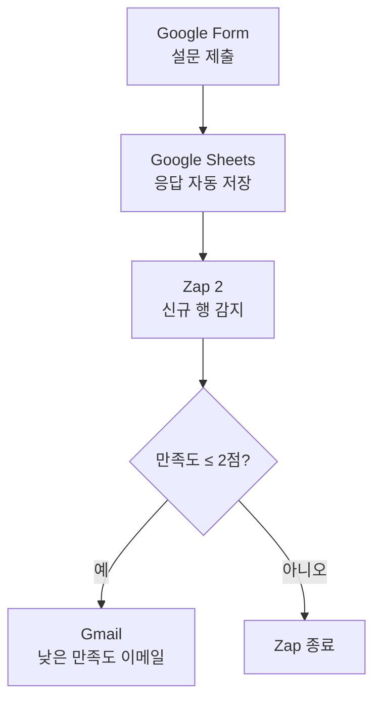
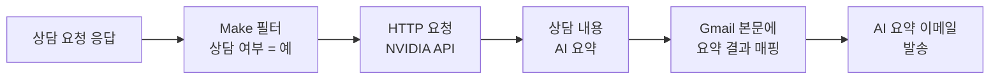

# B1-3 노코드 자동화 최종 흐름도

Google Form으로 수집한 프로그램 만족도와 상담 요청을 Google Sheets에 저장하고, Make와 Zapier를 이용해 조건별 이메일을 발송하도록 구성하였다.

Make에는 보너스 과제로 NVIDIA 생성형 AI API를 연동하여 상담 내용을 자동으로 요약하는 기능을 추가하였다.

---

## 1. Make 최종 자동화 흐름도

### Make 분기 조건

| 분기 | 필터 조건 | 처리 결과 |
|---|---|---|
| 낮은 만족도 분기 | 프로그램 만족도 `2점 이하` | 낮은 만족도 이메일 발송 |
| NVIDIA AI 요약 분기 | 상담 필요 여부 `예` | NVIDIA API 호출 후 AI 요약 이메일 발송 |
| 조건 미충족 | 만족도 3점 이상이고 상담 요청이 `아니오` | 추가 작업 없이 종료 |

두 분기는 모두 일반 분기로 설정했으며 `Fallback route`는 사용하지 않았다.

두 조건을 동시에 충족하면 Make에서 다음 이메일 두 통이 각각 발송된다.

1. 낮은 만족도 알림 이메일
2. NVIDIA AI 상담 요약 이메일

---

## 2. Zapier 상담 요청 자동화 흐름도

---

## 3. Zapier 낮은 만족도 자동화 흐름도

Zapier에서는 상담 요청과 낮은 만족도 알림을 하나의 Zap에서 분기하지 않고, 조건별로 두 개의 Zap을 구성하였다.

---

## 4. Make와 Zapier 구성 차이

| 구분 | Make | Zapier |
|---|---|---|
| 자동화 구성 | 하나의 시나리오에서 Router로 분기 | 조건별 Zap 2개로 분리 |
| 낮은 만족도 처리 | 낮은 만족도 이메일 발송 | 낮은 만족도 이메일 발송 |
| 상담 요청 처리 | NVIDIA AI 요약 이메일 발송 | 일반 상담 요청 이메일 발송 |
| AI 기능 | NVIDIA AI API 연동 | 적용하지 않음 |
| 두 조건 동시 충족 | 두 분기가 각각 실행 | 두 Zap이 각각 실행 |
| 최종 발송 결과 | 낮은 만족도 메일 + AI 요약 메일 | 낮은 만족도 메일 + 상담 요청 메일 |

---

## 5. 조건별 최종 실행 결과

| 설문 응답 조건 | Make 실행 결과 | Zapier 실행 결과 |
|---|---|---|
| 만족도 2점 이하·상담 아니오 | 낮은 만족도 메일 | 낮은 만족도 메일 |
| 만족도 3점 이상·상담 예 | NVIDIA AI 요약 메일 | 상담 요청 메일 |
| 만족도 2점 이하·상담 예 | 낮은 만족도 메일 + AI 요약 메일 | 낮은 만족도 메일 + 상담 요청 메일 |
| 만족도 3점 이상·상담 아니오 | 추가 작업 없음 | 두 Zap 모두 종료 |

두 조건을 모두 충족하면 Make에서 2통, Zapier에서 2통으로 총 4통의 이메일이 발송된다.

---

## 6. NVIDIA AI 보너스 처리 과정

AI 요약 기능은 만족도 점수가 아니라 `상담 필요 여부 = 예` 조건을 기준으로 실행된다.

Make 무료 플랜에서는 Google Sheets의 신규 응답을 최소 15분 간격으로 확인한다. 이는 이메일을 15분마다 반복 발송하는 것이 아니라, 새로운 설문 응답이 있는지 15분마다 확인하는 방식이다.
